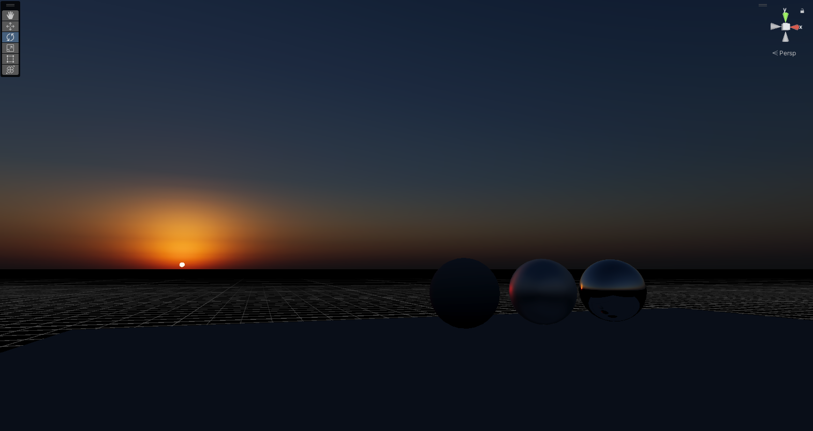
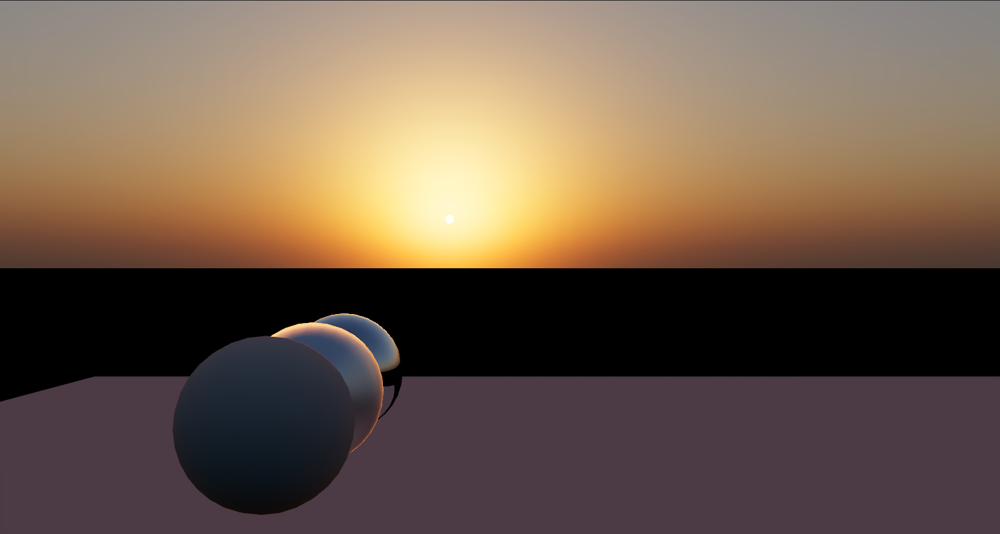
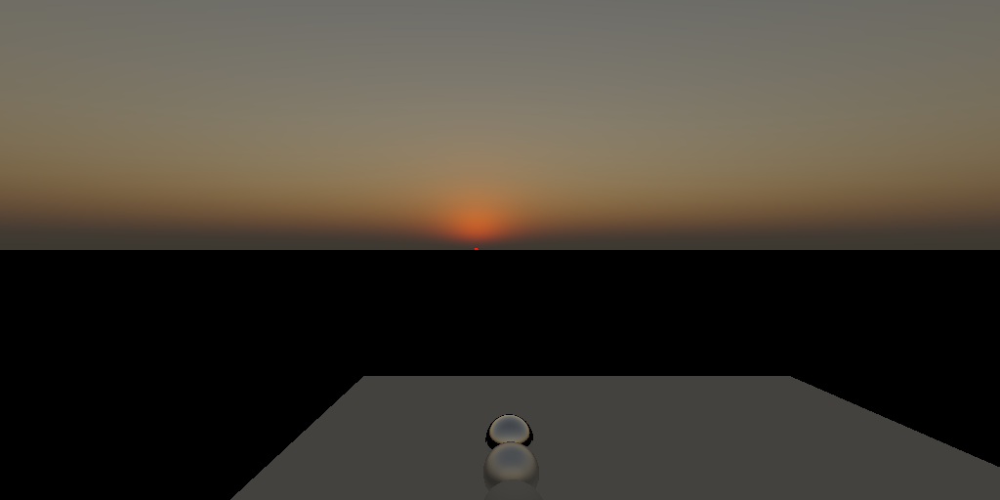
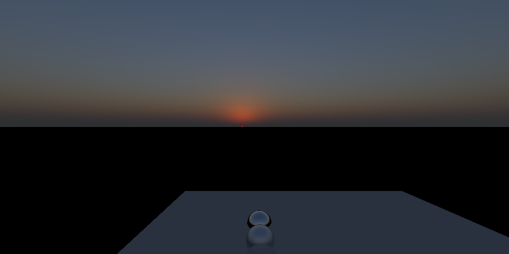
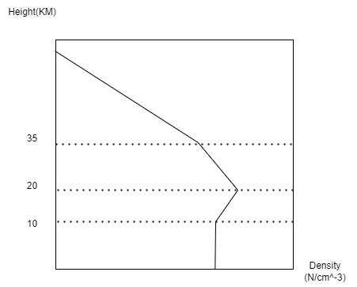

# ABUS - A Blue Unity Sky  

  

(Currently) ABUS is my prototype project, tries to find the solution towards NEXT-GEN atmosphere rendering.    
The targets include:  
- High Quality Visual 
  - Based on **Spectrum Rendering** 
  - And **Realistic Atmosphere Modeling**
  - To create a realistic **BLUE** sky.  
- Runtime Parameter Update
  - No offline baking etc.  
- Shippable Performance   
- Artist-Friendly UX  

Features in this project are heavily inspired by [Suzuki23]. It's an awesome talk!    

> Note that this project doesn't aim to be a "drop-in" atmosphere solution.    
> For any serious game, atmosphere rendering should be highly integrated into rendering pipeline.    
> So there's simply no way to create a "drop-in" plugin.  
> 
> Again, this project is just a prototype, its only purpose is to demonstrate how to create a realistic sky(with source code).    

## Current Features  
- Atmosphere modeling  
  - Air molecule(Rayleigh)  
  - Ozone
  - Aerosol(Mie)
  - Data based on previous work/real-world data
- Atmosphere rendering
  - Spectrum rendering
  - Multiple-Scattering Approximation Based on [Hillaire20]

## WIP
These are features currently be worked on.  

- [ ] Scene Aerial Perspective  
- [x] Adaptive Sampling near planet surface (high frequency atmosphere change)  
- [ ] Profiling and Optimization Plan  
  - For figuring out best LUT sizes, wavelength parameters etc.  
- [ ] Wavelength distribution optimization.  
  - Currently wavelength are chosen uniformly without considering sun radiance of that wavelength. Optimization could be done here.   

## Technical Details
Here's some details about current implementation.

You might need some basic knowledge about atmosphere rendering, to understand these content.  
If you're interested to know more, I'd like to recommend you Alan Zucconi's great [tutorial](https://www.alanzucconi.com/2017/10/10/atmospheric-scattering/).  

### Spectrum Rendering  
In my experiment, spectrum rendering plays an important role for more accurate sky.  

The common solutions in Unity HDRP and UE4, they all uses conventional RGB rendering.  

Rayleigh scattering has a dependence on wavelength. If only 3 wavelength(R,G,B) are picked, the result just can't be right.  

Also, the rayleigh coefficients used in most implementation, which originates from [Bruneton08], is actually coefficients for 3 wavelength.  
while we know that R,G,B in sRGB don't correspond to any actual wavelength. These coefficients seems to make no sense.       

Also according to the mie theory, when particle size is near with wavelength, there could also be color dispersion. Using spectrum rendering it's easier to catch this difference.   

### Rayleigh  
Rayleigh scattering is improved than the common implementation.  

Most common implementation uses 3 pre-computed coefficients for R,G,B scattering, based on [Nishita93].  

In this implementation, we derive the rayleigh scattering coefficient based on [Bucholtz95].  

Such that we supports calculating rayleigh scattering coefficient for any wavelength, and take the King Factor into account.  

See RayleighUtils.cs for more.  

Still there's something I'd like to investigate, like how temperature/humidity would affect air refractive index, and to see if that will affect rayleigh scattering.  

### Ozone
Ozone plays a **far more** important role in the simulation than most people think.   

According to [Hulburt53], during sunset/sunrise, 2/3 of the blue color is contributed by ozone layer.  

This is important for a sunset/sunrise scene. 

Here's a comparison of ozone layer on/off.  

| Ozone Off                | Ozone On                |
|--------------------------|-------------------------|
|  |  |  

In current implementation, the ozone vertical profile is hard-coded as a graph like this:     
  
Shape of the graph is based on a graph in [Sonkaew09] claimed to be measured data.  

In real life, the ozone layer changes with time and location.    
So an density slider is given to user to control the ozone density.  

### Mie
WIP (This doc).

## References
- [Suzuki23] Realistic Real-time Sky Dome Rendering in Gran Turismo 7
- [Nishita93] Display of The Earth Taking into Account Atmospheric Scattering  
- [BASM98] Optical Properties of Aerosols and Clouds: The Software Package OPAC  
- [Hillaire20] A Scalable and Production Ready Sky and Atmosphere Rendering Technique  
- [Prahl23] Mie Scattering. https://github.com/scottprahl/mie 
- [Hulburt53] Explanation of the Brightness and Color of the Sky
- [Bruneton08] Precomputed Atmospheric Scattering
- [Sonkaew09] Cloud sensitivity studies for stratospheric and lower mesospheric ozone profile retrievals from measurements of limb-scattered solar radiation