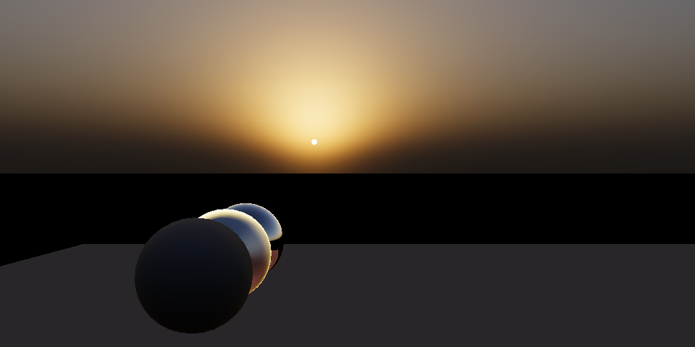

# ABUS - A Blue Unity Sky

> <del> Oh look, yet another boring sky rendering project :( </del>  
>
> No, it's not!  


(Currently) ABUS is my prototype project, tries to find the solution towards NEXT-GEN atmosphere rendering.    
The targets include:  
- High Quality Visual 
  - Based on **Spectrum Rendering** 
  - And **Realistic Atmosphere Modeling**
  - To create a realistic **BLUE** sky.  
- Runtime Parameter Update
  - No offline baking etc.  
- Shippable Performance   
- Artist-Friendly UX

Features in this project are heavily inspired by [Suzuki23]. It's an awesome talk!    

> Note that this project doesn't aim to be a "drop-in" atmosphere solution.    
> For any serious game, atmosphere rendering should be highly integrated into rendering pipeline.    
> So there's simply no way to create a "drop-in" plugin.  
> 
> Again, this project is just a prototype, its only purpose is to demonstrate how to create a realistic sky(with source code).    

# Get Started

This repo is a complete Unity project. Use git clone to download:  
```bash
git clone https://github.com/yangrc1234/Blue-Unity-Sky.git [FolderName]
```

The project structure is like this:  
```
- Abus
  - Assets
  - Packages
  - ProjectSettings
  - ...
- Docs
- PrahlMieLib
```

If you're on Windows, you should just be able to open the project in `Abus` folder with Unity 2022.3.17.   

> If you're not on Windows, you must compile the library in `PrahlMieLib` manually, then drop it into the unity project.  
> Currently PrahlMieLib is a VC++ project, you need to create a C++ project using toolchain on your platform.  Sorry for the inconvenience :(  

## Play with the sample scene  
You can open the scene `SampleScene` in `Assets/Abus/Sample/Scenes` folder.

You should see a scene like this:  
  

The only GameObject you need to care about are `AbusManager` and `Directional Light`,  
- `AbusManager` contains atmosphere settings, rendering settings, scene lighting settings etc,  
- `Directional Light` is the light for lighting the scene, also it's transform tells atmosphere system where the sun is.

### Play with the atmosphere settings  
You can play with the atmosphere settings in `AbusManager` GameObject.

There're 4 components on `AbusManager` for different features:  
- Abus Core  
  - Everything about atmosphere and sun. 
- Abus Aerosol Mixer
  - Helps setup aerosol settings. See details later.  
- Abus Lut Updater
  - Controls atmosphere rendering.
- Abus Scene Lighting
  - Setup scene lighting. Like assign light intensity to the `Directional Light`, Skybox material, fog color etc.  

By default, all parameters are set to a reasonable value for simulating earth atmosphere.  
But you could play with them to see how they affect the sky.  
Here's a simple guide on some most important parameters.  

#### Rayleigh Scattering  
Air molecule on earth creates Rayleigh scattering.  
Rayleigh scattering is dependent on wavelength, it makes the sky blue, and the sun yellow.  

You can adjust air molecule distribution in the `Rayleigh` section. 

#### Ozone  
Ozone makes sky more blue during sunset/sunrise.  

You can adjust ozone density in the `Ozone` section.

#### Aerosol
Besides air molecule, aerosol also contributes to sky color.  
To achieve a more realistic sky, ABUS uses a much more complicated aerosol authoring system compared to conventional real-time solutions.  
Which makes it difficult to directly configure aerosols.  

To make it easier, an `Abus Aerosol Mixer` component is provided.  
Which allows user to pick a pre-built "Aerosol Type Profile", and adjust an overall intensity.

User could choose a profile based on the scene they want to create.  
Then adjust intensity based on time of day etc.   

> The aerosol profiles are based on data from [BASM98].  
> Some aerosol values are modified to be more suitable in current simulation accuracy.    
 
## Current Features  
- Atmosphere modeling  
  - Air molecule(Rayleigh)  
  - Ozone
  - Aerosol(Mie)
  - Data based on previous work/real-world data
- Atmosphere rendering
  - Spectrum rendering
  - Multiple-Scattering Approximation Based on [Hillaire20]

## WIP
These are features currently be worked on.  

- [ ] Scene Aerial Perspective  
- [x] Adaptive Sampling near planet surface (high frequency atmosphere change)  
- [ ] Profiling and Optimization Plan  
  - For figuring out best LUT sizes, wavelength parameters etc.  
- [ ] Wavelength distribution optimization.  
  - Currently wavelength are chosen uniformly without considering sun radiance of that wavelength. Optimization could be done here.
- [ ] Cloud Layer
  - Not actual cloud rendering, just part of atmosphere modeling, which is important for overcast weather.  

# Technical Details
Here's some details about current implementation.

You might need some basic knowledge about atmosphere rendering, to understand these content.  
If you're interested to know more, I'd like to recommend you Alan Zucconi's great [tutorial](https://www.alanzucconi.com/2017/10/10/atmospheric-scattering/).  

## LUTs and Multiple Scattering  
The most fundamental rendering pipeline is based on [Hillaire20].  
LUT calculation, multiple scattering approximation is based on this great work. 

## Spectrum Rendering  
In my experiment, spectrum rendering plays an important role for more accurate sky.  

The common solutions in Unity HDRP and UE4, they all uses conventional RGB rendering.  

Rayleigh scattering has a dependence on wavelength. If only 3 wavelength(R,G,B) are picked, the result just can't be right.  

Also, the rayleigh coefficients used in most implementation, which originates from [Bruneton08], is actually coefficients for 3 wavelength.  
while we know that R,G,B in sRGB don't correspond to any actual wavelength. These coefficients seems to make no sense.       

Also according to the mie theory, when particle size is near with wavelength, there could also be color dispersion. Using spectrum rendering it's easier to catch this difference.   

## Air Molecule (Rayleigh Scattering)  
Rayleigh scattering is improved than the common implementation.  

Most common implementation uses 3 pre-computed coefficients for R,G,B scattering, based on [Nishita93].  

In this implementation, we derive the rayleigh scattering coefficient based on [Bucholtz95].  

Such that we supports calculating rayleigh scattering coefficient for any wavelength, and take the King Factor into account.  

See RayleighUtils.cs for more.  

Still there's something I'd like to investigate, like how temperature/humidity would affect air refractive index, and to see if that will affect rayleigh scattering.  

## Ozone
Ozone plays a **far more** important role in the simulation than most people think.   

According to [Hulburt53], during sunset/sunrise, 2/3 of the blue color is contributed by ozone layer.  

This is important for a sunset/sunrise scene. 

Here's a comparison of ozone layer on/off.  

| Ozone Off                | Ozone On                |
|--------------------------|-------------------------|
|  |  |  

### Density
In current implementation, the ozone vertical profile is hard-coded as a graph like this:     
  
Shape of the graph is based on a graph in [Sonkaew09] claimed to be measured data.  

In real life, the ozone layer changes with time and location.    
So an density slider is given to user to control the ozone density.  

### Absorption Cross-Section  
Absorption cross-section of ozone highly depends on wavelength. 
Currently we use data from [Gorshelev14].  

It should be noted that, ozone absorption also changes with temperature.   
And the atmosphere temperature also changes with height.  
It's just too complicated to take these into consideration.  
In current implementation, we just use the data at 233K.    

## Aerosol (Mie Scattering)
Aerosols are most difficult to simulate.  
There're mainly 2 problems to solve, first is distribution, second is optical characteristics.  

### Distribution  
Aerosols come from many sources, like human activities, wind-blown dust, volcanic eruption etc.  
Aerosols of different type also has different distribution.  

Luckily, [BASM98] provides a set of aerosol profiles for different type of aerosols, which proves to be good enough for our simulation.  

### Optical Characteristics
Mie scattering calculation is improved in mainly 2 aspects.  

Firstly, we use BHMIE[Prahl123] algorithm to calculate a more accurate Mie scattering coefficient.  
This makes our mie scattering responds to different wavelength, which is ignored in other conventional implementations.  

| Wavelength Indenpendent | Wavelength Dependent    |
|-----------------------------|-------------------------|
|     |  |  

Secondly, most implementations use an user-configurable HG phase function for mie phase.  Which is again far from accurate.    
Although it's possible to calculate a physically-correct phase function using BHMIE, it needs a much higher samples over particle radius to be visually correct.  

Here we use an improved phase function from [Jendersie23]. 
This gives mie scattering a more realistic also sharper forward-scattering.    

| HG Phase                                  | [Jendersie23] |
|-------------------------------------------|---------------|
|  |                |  


# References
- [Suzuki23] Realistic Real-time Sky Dome Rendering in Gran Turismo 7
- [Nishita93] Display of The Earth Taking into Account Atmospheric Scattering  
- [BASM98] Optical Properties of Aerosols and Clouds: The Software Package OPAC  
- [Hillaire20] A Scalable and Production Ready Sky and Atmosphere Rendering Technique  
- [Prahl23] Mie Scattering. https://github.com/scottprahl/mie 
- [Hulburt53] Explanation of the Brightness and Color of the Sky
- [Bruneton08] Precomputed Atmospheric Scattering
- [Sonkaew09] Cloud sensitivity studies for stratospheric and lower mesospheric ozone profile retrievals from measurements of limb-scattered solar radiation
- [Gorshelev14] High spectral resolution ozone absorption cross-sections.
- [Jendersie23] An Approximate Mie Scattering Function for Fog and Cloud Rendering