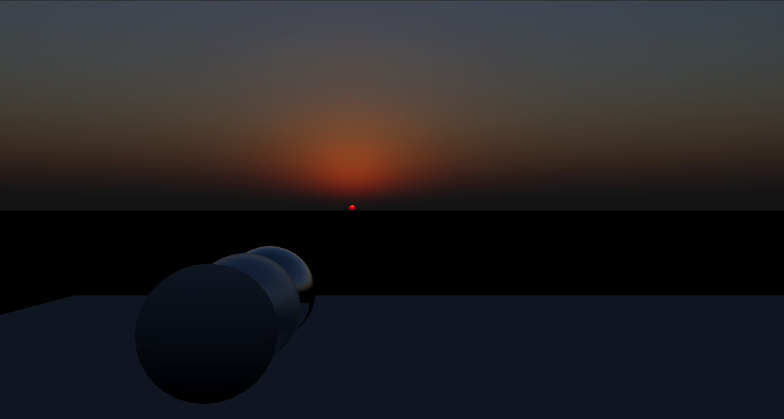

# ABUS - A Blue Unity Sky  

(Currently) ABUS is my prototype project, tries to find the solution towards NEXT-GEN atmosphere rendering.    
The targets include:  
- High Quality Visual 
  - Based on **Spectrum Rendering** 
  - And **Realistic Atmosphere Modeling**
- Runtime Parameter Update
  - No offline baking etc.  
- Shippable Performance   
- Artist-Friendly UX

Features in this project are heavily inspired by [Suzuki23]. It's an awesome talk!    

## Current Features  
- Atmosphere modeling  
  - Air molecule(Rayleigh)  
  - Ozone
  - Aerosol(Mie)
  - Data based on previous work/real-world data
- Atmosphere rendering
  - Spectrum rendering
  - Multiple-Scattering Approximation Based on [Hillaire20]

## WIP
These are features currently be worked on.  

- Scene Aerial Perspective  
- Profiling and Optimization Plan  
  - Figure out best LUT sizes, wavelength parameters etc.  
- Adaptive Sampling  

## References
- [Suzuki23] Realistic Real-time Sky Dome Rendering in Gran Turismo 7
- [BASM98] Optical Properties of Aerosols and Clouds: The Software Package OPAC  
- [Hillaire20] A Scalable and Production Ready Sky and Atmosphere Rendering Technique  
